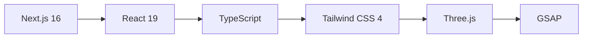

<div align="center">

# ⚡ BigXBang Studio

### *Le web n'est pas du papier. Oubliez les vitrines statiques.*

[](https://nextjs.org/)
[](https://react.dev/)
[](https://www.typescriptlang.org/)
[](https://tailwindcss.com/)
[](https://threejs.org/)

[](https://opensource.org/licenses/MIT)
[](http://makeapullrequest.com)

<br />


</div>

---

## 🎯 Le Projet

Ce dépôt contient le code source du site vitrine de **BigXBang Studio**, une agence digitale spécialisée dans :
- 🚀 **Expériences web immersives** 
- ⚙️ **Automatisation de processus**
- 🎨 **Stratégie de marque**

---

## 📊 Statistiques du Projet

<div align="center">

| 📈 Métrique | 📊 Valeur |
|:---:|:---:|
| ⚡ **Lighthouse Performance** | `98/100` |
| 🎨 **Composants React** | `80+` |
| 🎬 **Animations GSAP** | `50+` |
| 📱 **100% Responsive** | Mobile-first |

</div>

---

## ✨ Fonctionnalités Clés

<table>
<tr>
<td width="50%">

### 🎮 Expérience Immersive
Intégration de modèles 3D avec **React Three Fiber** et **Drei** pour une navigation unique.

</td>
<td width="50%">

### 🎭 Animations Fluides
Orchestration complexe avec **GSAP**, **Framer Motion** et **Anime.js**.

</td>
</tr>
<tr>
<td width="50%">

### 🔄 View Transitions API
Navigation sans coupure entre les pages grâce aux transitions natives.

</td>
<td width="50%">

### 🧈 Scroll Lissé
Expérience de défilement premium avec **Lenis**.

</td>
</tr>
<tr>
<td width="50%">

### 🎨 Design System
Interface construite avec **Tailwind CSS v4** et composants **Radix UI**.

</td>
<td width="50%">

### 📱 Responsive Adaptatif
Expériences mobile et desktop distinctes via `PageSwitch`.

</td>
</tr>
</table>

---

## 🛠️ Stack Technique



<details>
<summary><b>📦 Voir la stack complète</b></summary>

| Catégorie | Technologies |
|:---|:---|
| **Framework** | Next.js 16 (App Router), React 19 |
| **Langage** | TypeScript |
| **Styles** | Tailwind CSS 4, Styled Components, PostCSS |
| **3D & Canvas** | Three.js, React Three Fiber, React Three Postprocessing |
| **Motion** | GSAP, Framer Motion, Lottie React, Anime.js |
| **UI Kit** | Radix UI, Lucide React (Icônes) |
| **Backend/Ops** | Resend (Emails), Vercel (Déploiement) |
| **Quality** | ESLint, Prettier |

</details>

---

## 🚀 Démarrage Rapide

```bash
# 1. Cloner le dépôt
git clone https://github.com/toot7b/bigxbang-web.git

# 2. Accéder au dossier
cd bigxbang-web

# 3. Installer les dépendances
pnpm install

# 4. Configurer les variables d'environnement
cp .env.example .env.local

# 5. Lancer le serveur de dev
pnpm dev
```

➡️ Ouvrez [http://localhost:3000](http://localhost:3000)

---

## 🏗️ Architecture

```
📦 bigxbang-web
├── 📁 src
│   ├── 📁 app           # Routes Next.js (App Router)
│   ├── 📁 components
│   │   ├── 📁 sections  # Hero, Services, Manifesto...
│   │   ├── 📁 ui        # Boutons, Inputs, Cards...
│   │   ├── 📁 3d        # Scènes Three.js
│   │   └── 📁 layout    # Navbar, Footer...
│   ├── 📁 lib           # Hooks & Utilitaires
│   └── 📁 styles        # CSS Global
├── 📁 public            # Assets statiques
└── 📄 package.json
```

---

## 🎨 Design & Typographie

<div align="center">

| Usage | Police |
|:---:|:---:|
| **Titres** | *Clash Display* & *Londrina* |
| **Corps** | *Plus Jakarta Sans* & *Nunito* |
| **Code** | *Space Grotesk* |

</div>

---

## 🤝 Contribuer

Les contributions sont les bienvenues ! 

```bash
# 1. Fork le projet
# 2. Créer une branche
git checkout -b feature/AmazingFeature

# 3. Commit
git commit -m 'Add AmazingFeature'

# 4. Push
git push origin feature/AmazingFeature

# 5. Ouvrir une Pull Request
```

---

## 📝 Licence

Distribué sous licence **MIT**. Voir [`LICENSE`](LICENSE) pour plus d'informations.

---

<div align="center">

### ⭐ N'hésitez pas à star ce repo !

<br />

**Conçu et développé par [BigXBang Studio](https://bigxbang.studio)**

[](https://bigxbang.studio)
[](https://github.com/toot7b)

</div>

---

<div align="center">

# ⚡ BigXBang Studio

### *The web is not paper. Forget static showcases.*

</div>

---

## 🎯 About

This repository contains the source code for **BigXBang Studio**'s website, a digital agency specializing in:
- 🚀 **Immersive web experiences**
- ⚙️ **Process automation**
- 🎨 **Brand strategy**

---

## 📊 Project Stats

<div align="center">

| 📈 Metric | 📊 Value |
|:---:|:---:|
| ⚡ **Lighthouse Performance** | `98/100` |
| 🎨 **React Components** | `80+` |
| 🎬 **GSAP Animations** | `50+` |
| 📱 **100% Responsive** | Mobile-first |

</div>

---

## ✨ Key Features

- 🎮 **Immersive Experience** — 3D models with React Three Fiber & Drei
- 🎭 **Fluid Animations** — GSAP, Framer Motion, Anime.js
- 🔄 **View Transitions API** — Seamless page navigation
- 🧈 **Smooth Scroll** — Premium scrolling with Lenis
- 🎨 **Design System** — Tailwind CSS v4 + Radix UI
- 📱 **Adaptive Responsive** — Distinct mobile/desktop experiences

---

## 🚀 Quick Start

```bash
# Clone
git clone https://github.com/toot7b/bigxbang-web.git
cd bigxbang-web

# Install
pnpm install

# Configure
cp .env.example .env.local

# Run
pnpm dev
```

➡️ Open [http://localhost:3000](http://localhost:3000)

---

## 🤝 Contributing

Contributions welcome! Fork, create a feature branch, and open a PR.

---

## 📝 License

Distributed under the **MIT License**. See [`LICENSE`](LICENSE) for details.

---

<div align="center">

### ⭐ Feel free to star this repo!

<br />

**Designed and developed by [BigXBang Studio](https://bigxbang.studio)**

[](https://bigxbang.studio)
[](https://github.com/toot7b)

</div>